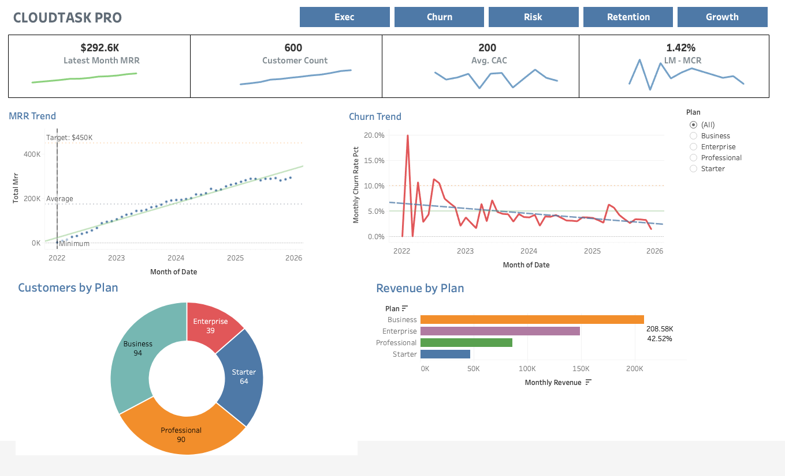
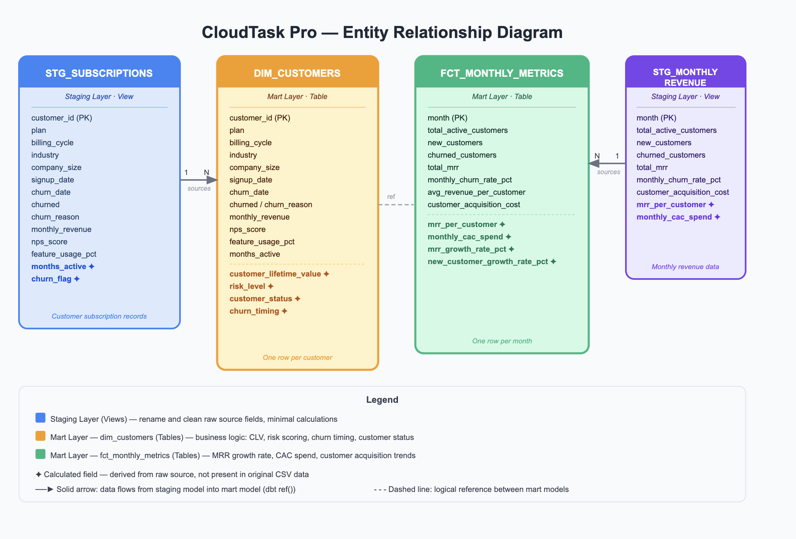
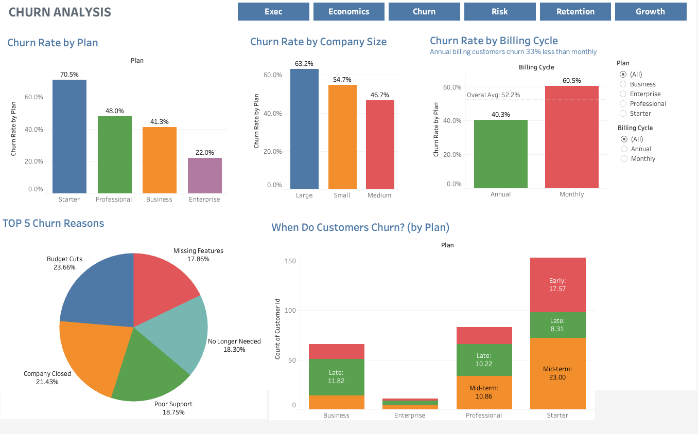
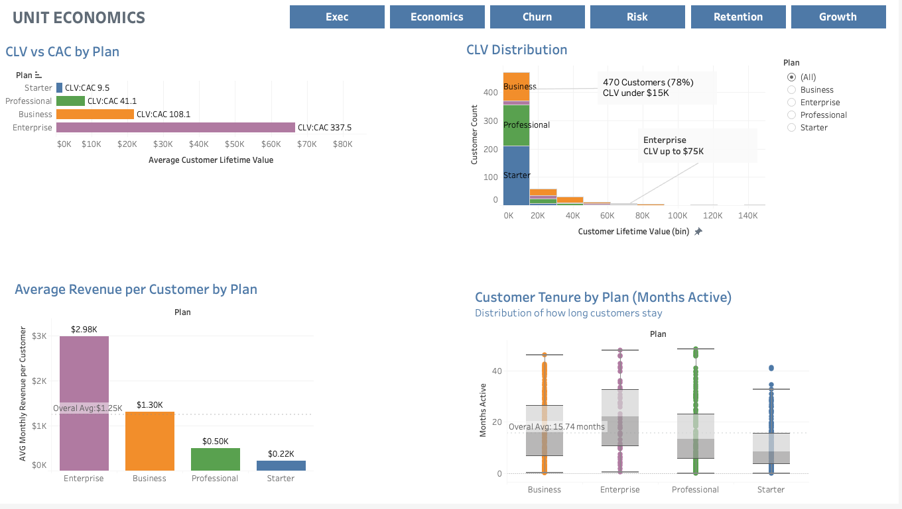
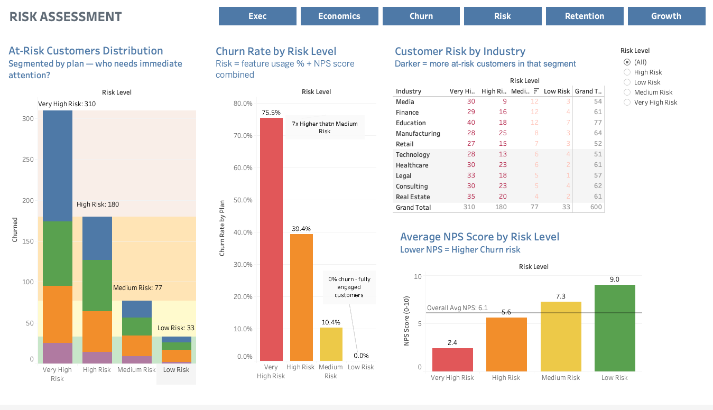
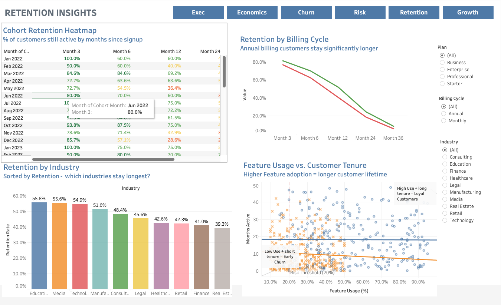
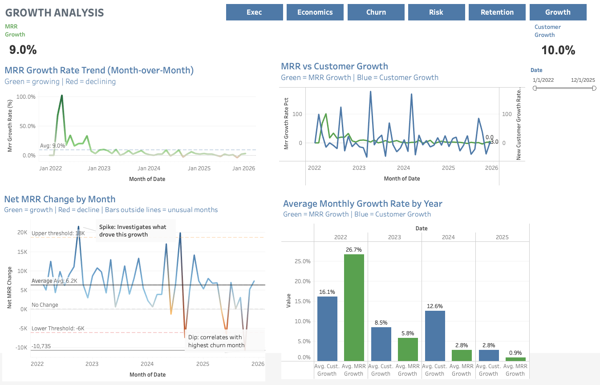

# 📊 CloudTask Pro — SaaS Churn & Revenue Analytics Platform

> End-to-end analytics platform built with Python, dbt, BigQuery, and Tableau to investigate board-level churn concerns for a fast-growing SaaS company.

## Table of Contents

* [Project Overview](#project-overview)
* [Executive Summary](#1-executive-summary)
* [Business Context](#2-business-context)
* [Architecture](#3-architecture)
* [Analysis](#4-analysis)
  + [Executive Summary Dashboard](#executive-summary-dashboard)
  + [Churn Analysis Dashboard](#churn-analysis-dashboard)
  + [Unit Economics Dashboard](#unit-economics-dashboard)
  + [Risk Assessment Dashboard](#risk-assessment-dashboard)
  + [Retention Insights Dashboard](#retention-insights-dashboard)
  + [Growth Analysis Dashboard](#growth-analysis-dashboard)
* [Key Insights](#5-key-insights)
* [Recommendations](#6-recommendations)
  + [Immediate Actions](#immediate-actions)
  + [Strategic Initiatives](#strategic-initiatives)
  + [Long-Term Opportunities](#long-term-opportunities)
* [Methodology](#methodology)
* [dbt Models](#dbt-models)
* [Data Quality Tests](#data-quality-tests)
* [Project Structure](#project-structure)
* [Quick Start](#quick-start)
* [Contact](#contact)

---

## Project Overview

CloudTask Pro Analytics is a production-grade data platform that simulates a real-world analytics engineering scenario:

> **"The board is concerned about churn. The CFO needs answers."**

CloudTask Pro is a hypothetical SaaS company with 600 customers and 4 years of data (2022–2025). Despite consistent revenue growth, the board raised concerns about a high cumulative churn rate threatening long-term profitability. The goal was to build a complete analytics platform from raw CSV data to six interactive executive dashboards — answering 5 CFO-level business questions along the way.

The focus of this project is on **data pipeline engineering, dimensional modeling, data quality testing, and executive dashboard design** — core responsibilities of a data analytics engineer role.

**Tech Stack:** Python · dbt · Google BigQuery · Tableau

---

## 1. Executive Summary

* **Goal:** Analyze 4 years of subscription and revenue data (2022–2025) to answer 5 CFO-level questions on churn trends, customer risk, unit economics, and retention — delivering a self-service analytics platform for executive stakeholders.

<!-- Add your Executive Summary dashboard screenshot here -->


* **Key Insights:**
  + All 4 subscription plans are highly profitable — Starter delivers a 9.5x CLV:CAC ratio; Enterprise reaches 337.5x
  + Annual billing customers churn 33% less than monthly customers (40.3% vs 60.5% cumulative)
  + Very High Risk customers churn at 75.5% — 7x higher than Medium Risk (10.4%)
  + Mid-term churn (months 3–12) accounts for 39.6% of all churned customers — the highest-risk window

* **Business Impact:** Executives now have self-service visibility into churn trends, risk levels, unit economics, and retention patterns — enabling proactive intervention before customers churn rather than reactive responses after.

---

## 2. Business Context

**Dataset Overview:**
This analysis uses two datasets covering CloudTask Pro's full customer history:

* **subscriptions.csv** — 600 customers with plan type, billing cycle, industry, company size, feature usage %, NPS score, churn status, churn reason, and support tickets (18 fields)
* **monthly_revenue.csv** — 48 months of aggregated metrics including MRR, new customers, churned customers, monthly churn rate, and customer acquisition cost

**Why It Matters:**
SaaS companies live or die by their churn rate. A 52.2% cumulative churn rate over 4 years means more than half the customer base needed to be replaced just to stay flat. Understanding which customers churn, when they leave, why they go, and what signals predict churn in advance — enables the business to shift from reactive to proactive retention.

**5 CFO Questions Answered:**

| # | Question | Answer |
|---|----------|--------|
| 1 | What is our churn rate and how is it trending? | 52.2% overall; declining from 20% (early 2022) to ~2% (2026) |
| 2 | Which plan and billing cycle churns most? | Starter (70.5%); monthly billing churns 33% more than annual |
| 3 | What are the top churn reasons? | Budget Cuts (23.7%), Company Closed (21.4%), Poor Support (18.8%) |
| 4 | Which plans are most profitable (CLV vs CAC)? | All plans exceed 3x CLV:CAC; Enterprise delivers 337.5x ratio |
| 5 | What signals predict churn? | Very High Risk customers (low feature usage + low NPS) churn at 7x Medium Risk rate |

---

## 3. Architecture



```
CSV Data (subscriptions.csv, monthly_revenue.csv)
        │
        ▼
Python ETL Pipeline
  • Data validation & type conversion
  • Null handling & referential integrity checks
  • Load to BigQuery raw tables
        │
        ▼
Google BigQuery (saas_analytics_dev)
  • Raw tables: subscriptions, monthly_revenue
        │
        ▼
dbt Transformations
  ├── Staging Layer (Views)
  │     ├── stg_subscriptions      → clean fields, calculate months_active
  │     └── stg_monthly_revenue    → clean fields, calculate mrr_per_customer
  │
  └── Mart Layer (Tables)
        ├── dim_customers          → CLV, risk scoring, churn timing, customer status
        └── fct_monthly_metrics    → MRR growth rate, churn trends, CAC spend
        │
        ▼
Data Quality (40+ automated dbt tests)
  • Uniqueness, not-null, accepted values
  • Referential integrity, business logic, range checks
        │
        ▼
Tableau Dashboards (6 interactive dashboards)
  ├── Dashboard 1: Executive Summary
  ├── Dashboard 2: Churn Analysis
  ├── Dashboard 3: Unit Economics
  ├── Dashboard 4: Risk Assessment
  ├── Dashboard 5: Retention Insights
  └── Dashboard 6: Growth Analysis
```


---

## 4. Analysis

### Executive Summary Dashboard

*The Executive Summary provides C-suite visibility into the four most critical KPIs: Latest Month MRR ($292.6K), total active customers (600), average CAC ($200), and latest month churn rate (1.42%). The MRR trend shows consistent upward growth from 2022 toward the $450K annual target. The churn trend shows a strong declining pattern — from a peak of 20% in early 2022 to approximately 2% by 2026, confirming retention initiatives are working. The Business plan drives 42.52% of total revenue despite not being the largest customer segment by count.*

<!-- Add your dashboard screenshot here -->


---

### Churn Analysis Dashboard

*Churn varies dramatically by plan — Starter customers churn at 70.5% while Enterprise customers churn at only 22.0%. Large companies churn most (63.2%) vs Medium (46.7%). Annual billing customers churn 33% less than monthly (40.3% vs 60.5%), with an overall average of 52.2%. The top 5 churn reasons are Budget Cuts (23.7%), Company Closed (21.4%), Poor Support (18.8%), No Longer Needed (18.3%), and Missing Features (17.9%). Mid-term churn (months 3–12) is the most common churn window at 39.6% of all churned customers — customers are passing onboarding but losing perceived value before their first renewal decision.*



---

### Unit Economics Dashboard

*All 4 plans are highly profitable with CAC consistently around $200 across plans regardless of tier. Enterprise delivers the strongest CLV:CAC ratio at 337.5x ($66.7K CLV), followed by Business at 108.1x ($21.9K CLV), Professional at 41.1x ($8.1K CLV), and Starter at 9.5x ($1.9K CLV). Average monthly revenue per customer ranges from $2.98K (Enterprise) to $0.22K (Starter). 78% of customers have CLV under $15K — driven primarily by mid-term churn compressing lifetime value before customers reach full revenue potential. Average customer tenure across all plans is 15.74 months.*



---

### Risk Assessment Dashboard

*The multi-factor risk model classifies all 600 customers into four tiers using feature usage percentage and NPS score. Very High Risk customers (310 total — 51.7% of the base) churn at 75.5%, compared to 39.4% (High Risk), 10.4% (Medium Risk), and 0.0% (Low Risk). Average NPS scores confirm the pattern: Very High Risk (2.4), High Risk (5.6), Medium Risk (7.3), Low Risk (9.0). The industry heatmap shows Education has the most Very High Risk customers (40), while Real Estate shows the highest risk concentration relative to its total count. Low Risk customers have 0% churn — confirming that fully engaged customers never leave.*



---

### Retention Insights Dashboard

*The cohort retention heatmap shows retention declining steeply between Month 3 and Month 12 across all cohorts — confirming the mid-term window as the critical intervention period. Annual billing customers retain significantly better than monthly at every milestone from Month 3 through Month 36. Education (55.8%), Media (55.6%), and Technology (54.9%) are the most loyal industries. Real Estate (39.3%) and Finance (41.0%) have the weakest retention. The Feature Usage vs. Churn scatter plot confirms that churned customers cluster at lower feature usage and shorter tenure, with the 20% usage threshold clearly separating the highest-risk customers from the rest.*



---

### Growth Analysis Dashboard

*Average monthly MRR growth rate is 9.0% and average customer acquisition growth is 10.0%. 2022 had the strongest performance with MRR growth at 26.7%, declining to 0.9% by 2025 as the market matured. The Net MRR Change chart identifies months with unusual spikes (upper threshold: $18K) and dips (lower threshold: -$6K). A significant dip of -$10,735 was identified correlating with the highest churn month in early 2024. MRR and customer growth tracked closely throughout — indicating revenue growth is primarily driven by new customer acquisition rather than expansion or upsell revenue.*



---

## 5. Key Insights

✔ **Billing Cycle is the Strongest Lever:** Annual billing customers churn 33% less than monthly (40.3% vs 60.5%). Shifting customers from monthly to annual billing is the single highest-impact retention action available with no product changes required.

✔ **Mid-Term Churn is the Biggest Problem:** 39.6% of churned customers leave between months 3 and 12 — not in the first 3 months as originally assumed. Customers are passing onboarding but losing perceived value before their first renewal decision.

✔ **Risk Model Works:** Very High Risk customers (feature usage <20% OR NPS <4) churn at 75.5% vs 0% for Low Risk. The model correctly identifies at-risk customers with enough lead time to intervene proactively.

✔ **All Plans are Profitable:** Even the entry-level Starter plan delivers a 9.5x CLV:CAC ratio — well above the 3x minimum SaaS health threshold. The business is not subsidizing any plan tier. Enterprise's 337.5x ratio represents exceptional unit economics.

✔ **Revenue Concentration Risk:** The Business plan generates 42.52% of total revenue from a single tier. A targeted retention program for Business customers would have an outsized impact on revenue stability.

✔ **Industry Signals:** Education (55.8%) and Media (55.6%) are consistently the most loyal industries. Prioritizing these segments for acquisition would improve overall cohort retention metrics naturally.

✔ **Growth is Decelerating:** MRR growth declined from 26.7% (2022) to 0.9% (2025). This signals a maturing acquisition model — the business needs to shift focus from acquisition-led growth to retention and expansion revenue.

---

## 6. Recommendations

### Immediate Actions

1. **Launch Annual Billing Incentive Program:**
   Offer a 10–15% discount for customers switching from monthly to annual billing. The 33% churn reduction justifies significant incentive spend. Priority: Monthly billing customers in the Very High Risk tier who also have high CLV.

2. **Implement Month 3 Intervention:**
   The 3-month mark is the start of the highest-churn window (39.6% of all churn). Trigger an automated engagement sequence at Day 60 for all customers with feature usage below 40% — including a product walkthrough, success review call, and ROI demonstration.

3. **Activate Risk-Based Outreach:**
   310 customers are classified as Very High Risk with a 75.5% churn rate. Assign CSM outreach immediately to the top 50 highest-value customers in this tier. Each saved Enterprise or Business customer represents $21K–$66K in retained lifetime value.

### Strategic Initiatives

4. **Build Expansion Revenue Motion:**
   With growth decelerating from 26.7% to 0.9%, new customer acquisition alone can no longer sustain revenue targets. Develop upsell paths from Starter → Professional and Professional → Business with feature-gated incentives tied to usage milestones.

5. **Industry-Specific Retention Programs:**
   Real Estate (39.3%) and Finance (41%) show weak retention. Design industry-specific onboarding and value demonstration tracks for these segments. Replicate the engagement patterns observed in Education and Media — the two strongest retention industries.

6. **Address Controllable Churn Reasons:**
   Budget Cuts (23.7%) and Company Closed (21.4%) are largely external and unavoidable. However, Poor Support (18.8%) and Missing Features (17.9%) are directly addressable. Invest in support quality standards and a structured product feedback loop connected to the roadmap.

### Long-Term Opportunities

7. **Add Expansion MRR Tracking:**
   The current model tracks acquisition and churn but not expansion revenue from plan upgrades. Adding upgrade event tracking to the data model would enable Net Revenue Retention (NRR) calculation — the most important leading indicator of SaaS growth health.

8. **Predictive Churn Scoring:**
   The current risk model uses static thresholds. A machine learning model trained on historical churn data could produce a dynamic monthly churn probability score — enabling earlier and more precise interventions before customers reach the mid-term danger zone.

9. **Automate the Pipeline:**
   Connect the pipeline to Cloud Scheduler for daily automated runs: Python validation → BigQuery load → dbt run → dbt test → Tableau extract refresh. Eliminate manual intervention from the data pipeline entirely.

---

## 📊 Methodology

**Data Ingestion:** Python ETL script validated data types, handled null values, enforced referential integrity, and loaded both datasets into Google BigQuery.

**Data Modeling:** dbt transformation layer following Kimball dimensional modeling principles across two layers:
- *Staging* (stg_subscriptions, stg_monthly_revenue): column renaming, type casting, and simple field calculations only
- *Marts* (dim_customers, fct_monthly_metrics): all business logic including CLV, multi-factor risk scoring, churn timing classification, and MRR/customer growth rates

**Data Quality:** 40+ automated dbt tests running on every model build to prevent bad data from reaching dashboards.

**Visualization:** Six Tableau dashboards with a consistent navigation bar, cross-dashboard filters (plan, industry, billing cycle, date range), and drill-down click actions.

**Tools Used:** Python (Pandas), dbt, Google BigQuery, Tableau

---

## 📊 dbt Models

### Staging Layer (Views)

| Model | Source | Purpose |
|-------|--------|---------|
| `stg_subscriptions` | subscriptions | Clean customer data, calculates months_active |
| `stg_monthly_revenue` | monthly_revenue | Clean monthly metrics, calculates mrr_per_customer |

### Mart Layer (Tables)

| Model | Grain | Purpose |
|-------|-------|---------|
| `dim_customers` | One row per customer | CLV, risk level, churn timing, customer status |
| `fct_monthly_metrics` | One row per month | MRR growth rate, churn trends, CAC spend |

### Key Calculated Fields

```sql
-- Customer Lifetime Value
customer_lifetime_value = monthly_revenue × months_active

-- Risk Level (multi-factor scoring)
CASE
  WHEN feature_usage_pct < 20 OR nps_score < 4 THEN 'Very High Risk'
  WHEN feature_usage_pct < 40 OR nps_score < 6 THEN 'High Risk'
  WHEN feature_usage_pct < 60 OR nps_score < 8 THEN 'Medium Risk'
  ELSE 'Low Risk'
END

-- Churn Timing Classification
CASE
  WHEN churned = 0           THEN 'Active'
  WHEN months_active < 3     THEN 'Early Churn (< 3 months)'
  WHEN months_active < 12    THEN 'Mid-Tenure Churn (3-12 months)'
  ELSE                            'Late Churn (> 12 months)'
END

-- MRR Growth Rate (month-over-month)
(current_mrr - previous_mrr) / previous_mrr × 100

-- months_active
CASE
  WHEN churned = 0 THEN date_diff(date('2025-12-31'), signup_date, day) / 30.0
  ELSE date_diff(churn_date, signup_date, day) / 30.0
END
```

---

## 🧪 Data Quality Tests

**40+ automated tests** across all models — run on every `dbt run`:

| Test Type | Example |
|-----------|---------|
| Uniqueness | `customer_id` has no duplicates in `dim_customers` |
| Not null | Required fields (customer_id, plan, signup_date) always populated |
| Accepted values | `risk_level` only in [Very High Risk, High Risk, Medium Risk, Low Risk] |
| Referential integrity | All customer_ids in fct_churn_analysis exist in dim_customers |
| Business logic | Churned customers must have a non-null `churn_date` |
| Range checks | `feature_usage_pct` between 0 and 100 |
| Monthly sanity | `total_mrr` cannot be negative |

```bash
# Run all tests
cd dbt
dbt test

# Run tests for a specific model
dbt test --select dim_customers

# Generate and view documentation
dbt docs generate
dbt docs serve   # Opens at http://localhost:8000
```

---

## 📁 Project Structure

```
cloudtask-pro-analytics/
│
├── data/
│   ├── monthly_revenue.csv          # Raw monthly metrics (48 months)
│   ├── subscriptions.csv            # Raw customer data (600 customers, 18 fields)
│   └── processed/                   # Cleaned datasets after Python validation
│
├── dbt/
│   ├── dbt_project.yml              # dbt project configuration
│   ├── packages.yml                 # dbt package dependencies
│   ├── profiles.yml                 # BigQuery connection settings
│   ├── models/
│   │   ├── staging/
│   │   │   ├── stg_subscriptions.sql
│   │   │   ├── stg_subscriptions.yml
│   │   │   ├── stg_monthly_revenue.sql
│   │   │   └── stg_monthly_revenue.yml
│   │   └── marts/
│   │       ├── dim_customers.sql
│   │       ├── fct_monthly_metrics.sql
│   │       └── marts.yml
│   ├── tests/
│   │   └── singular/                # Custom SQL business logic tests
│   └── target/                      # Compiled models (git ignored)
│
├── notebooks/
│   └── EDA.ipynb                    # Exploratory data analysis
│
├── images/                          # Dashboard screenshots for README
│
├── .gitignore
└── README.md
```

---

## 🚀 Quick Start

### 1. Clone the repository
```bash
git clone https://github.com/YOUR_USER/cloudtask-pro-analytics.git
cd cloudtask-pro-analytics
```

### 2. Set up Python environment
```bash
python -m venv venv
source venv/bin/activate        # Windows: venv\Scripts\activate
pip install -r requirements.txt
```

### 3. Configure Google Cloud
```bash
gcloud auth login
gcloud config set project YOUR_GCP_PROJECT_ID
bq mk --dataset saas_analytics_dev
```

### 4. Explore the data (optional)
```bash
jupyter notebook notebooks/EDA.ipynb
```

### 5. Run dbt
```bash
cd dbt
dbt deps          # Install packages
dbt run           # Build all models
dbt test          # Run all 40+ tests
dbt docs generate # Generate documentation
dbt docs serve    # View at http://localhost:8000
```

### 6. Connect Tableau
```
1. Open Tableau Desktop
2. Connect → Google BigQuery
3. Project: your-gcp-project
4. Dataset: saas_analytics_dev
5. Tables: dim_customers, fct_monthly_metrics
6. Build dashboards
```

---

## 📄 License

MIT — free to use for learning and portfolio purposes.

---

## 📧 Contact

**Your Name**
📧 elcjones@proton.me
💼 [LinkedIn](https://www.linkedin.com/in/elenajoneslc/)
🐙 [GitHub](https://github.com/eluzuriaga83)
